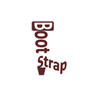

```
Roberto Nogueira  BSd EE, MSd CE
Solution Integrator Experienced - Certified by Ericsson
```
# Full Stack Web Development Specialisation

## Front-End Web UI Frameworks and Tools



**About the Course**

This module gives you a quick introduction to full-stack web development and the outline of the course. Then you will learn the basics of Bootstrap, setting up a web project using Bootstrap. You will learn about responsive design and the Bootstrap grid system. You will also learn about Navigation and Navigation bar. At the end of this module, you need to complete your first assignment.

## Table of Contents

```
Syllabus

Week 1
Full Stack Web Development: The Big Picture
[x] Objectives and Outcomes 10 min
[x] What is Full Stack Web Development? 5 min
[x] Course Overview 4 min
[x] How to Use the Learning Resources 8 min
[x] Full Stack Web Development: Additional Resources 10 min

Introduction to Bootstrap
[ ] Objectives and Outcomes 10 min
[ ] Front-end Web UI Frameworks: An Introduction 6 min
[ ] Introduction to Bootstrap 2 min
[ ] Getting Started with Bootstrap 9 min
[ ] Setting up your Development Environment 10 min
[ ] Exercise (Video): Getting Started with Bootstrap 11 min
[ ] Exercise (Instructions): Getting Started with Bootstrap 10 min
[ ] Practice Quiz: Introduction to Bootstrap 3 questions

Introduction to Bootstrap: Additional Resources10 min
[ ] Responsive Design and Bootstrap Grid System
[ ] Objectives and Outcomes10 min
[ ] Responsive Design12 min
[ ] Bootstrap Grid System16 min
[ ] Exercise (Video): Responsive Design and Bootstrap Grid System17 min
[ ] Exercise (Instructions): Responsive Design and Bootstrap Grid System10 min
[ ] Practice Quiz: Responsive Design and Bootstrap Grid System3 questions
[ ] Responsive Design and Bootstrap Grid System: Additional Resources10 min

Navigation and Navigation Bar
[ ] Objectives and Outcomes10 min
[ ] Navigation and Navigation Bar11 min
[ ] Bootstrap Navbar13 min
[ ] Icon Fonts7 min
[ ] Exercise (Video): Navbar18 min
[ ] Exercise (Instructions): Navbar10 min
[ ] Practice Quiz: Navigation and Navigation Bar3 questions
[ ] Navigation and Navigation Bar: Additional Resources10 min
[ ] Assignment 1

Assignment 1 Requirements (Video)3 min
[ ] Peer Graded Assignment: Assignment 1 Detailed Instructions and Submission1h
[ ] Due in 7 days
[ ] Review Your Peers: Assignment 1 Detailed Instructions and Submission
[ ] Due in 10 days
[ ] Assignment 1: Resources10 min


Week 2
[ ] Bootstrap CSS Components

Week 3
[ ] Bootstrap Javascript Components

Week 4
[ ] Web Tools
```
